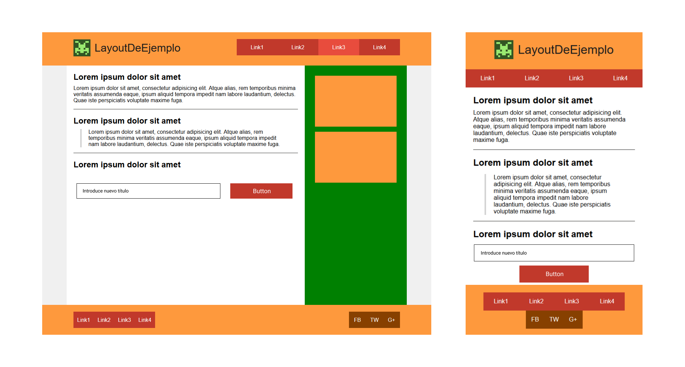

# CREATE - Prueba técnica

La prueba consisitía en realizar una página web responsive dado el siguiente modelo (web y móvil):

## Requisitos

- [x] El layout se compone de logo + menú + cuerpo con un aside a la derecha + footer.
- [x] La tipografía utilizada es Arial. **Finalmente he mantenido esta tipografía.**
- [x] El logo está en images/logo.png. **Adicionalmente, he añadido un favicon, se encuentra también en la carpeta img.**
- [x] Hover similar al del "link3" mostrado en la imagen de referencia. **Tiene una transición sencilla**.
- [x] Versión móvil (resoluciones menores a 500px) y versión desktop (resoluciones mayores a 1024px). **Se ha trabajado pensando primero en dispositivos móviles _(mobile first)_.**
- [x] Se ha añadido una **versión tablet** para las resoluciones comprendidas entre las anteriores.
- [x] No se ha utilizado ningún framework de CSS. Se ha implementado la metodología BEM en la medida de lo posible.
- [x] Funcionalidad del botón: si introducimos un texto en el input y pulsamos en dicho botón, el texto introducido sustituye al título principal del layout. Realizado con Vanilla JS.

## Cómo arrancar el proyecto

El proyecto se puede visualizar descargándolo el proyecto y utilizando el `Live Server` de Visual Studio Code.

## Tecnologías empleadas

Se ha realizado en `HTML5` y `CSS3`. La funcionalidad del botón ha sido añadida con `JavaScript`.
No se han utilizado frameworks ni librerías, pero sí el preprocesador `SASS` para hacer más sencilla la maquetación.
